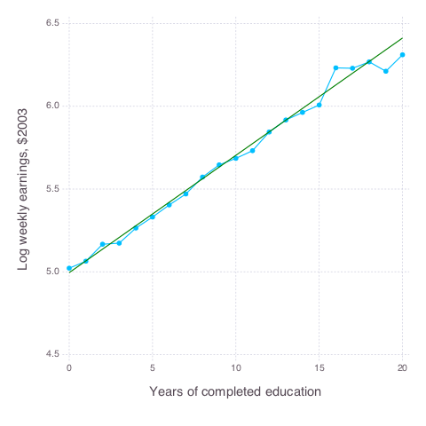

# 03 Making Regression Make Sense
## 3.4 Regression Details

### Figure 3-1-2
Completed in [Stata](Figure%203-1-2.do), [R](Figure%203-1-2.r), [Python](Figure%203-1-2.py) and [Julia](Figure%203-1-2.jl)

### Table 3-3-2
Completed in [Stata](Table%203-3-2.do) and [R](Table%203-3-2.r)

_Covariate means in the NSW and observational control samples_

|                   |NSW Treat |NSW Control |Full CPS-1 |Full CPS-3 |P-score CPS-1 |P-score CPS-3 |
|:------------------|:---------|:-----------|:----------|:----------|:-------------|:-------------|
|Age                |25.82     |25.05       |33.23      |28.03      |25.63         |25.97         |
|Years of Schooling |10.35     |10.09       |12.03      |10.24      |10.49         |10.42         |
|Black              |0.84      |0.83        |0.07       |0.2        |0.96          |0.52          |
|Hispanic           |0.06      |0.11        |0.07       |0.14       |0.03          |0.2           |
|Dropout            |0.71      |0.83        |0.3        |0.6        |0.6           |0.63          |
|Married            |0.19      |0.15        |0.71       |0.51       |0.26          |0.29          |
|1974 earnings      |2,096     |2,107       |14,017     |5,619      |2,821         |2,969         |
|1975 earnings      |1,532     |1,267       |13,651     |2,466      |1,950         |1,859         |
|Number of Obs.     |185       |260         |15,992     |429        |352           |157           |
